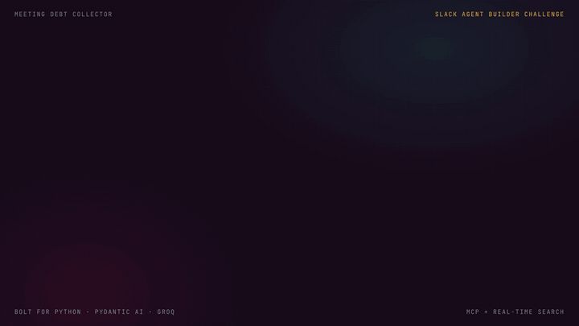
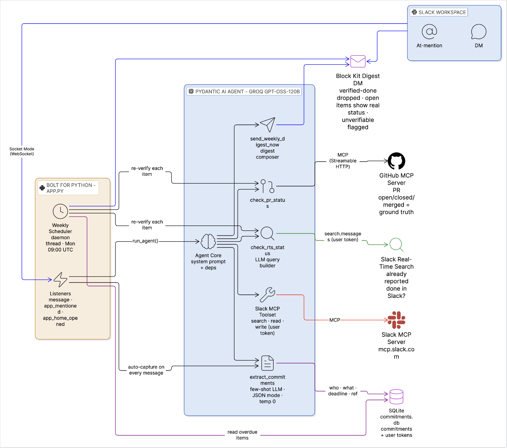
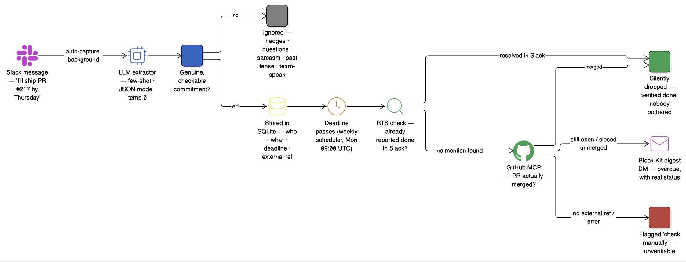
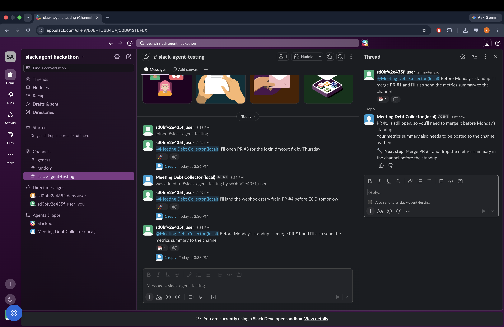
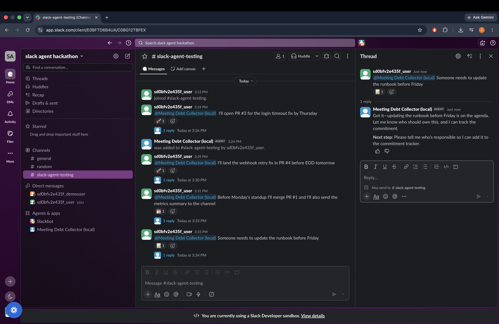
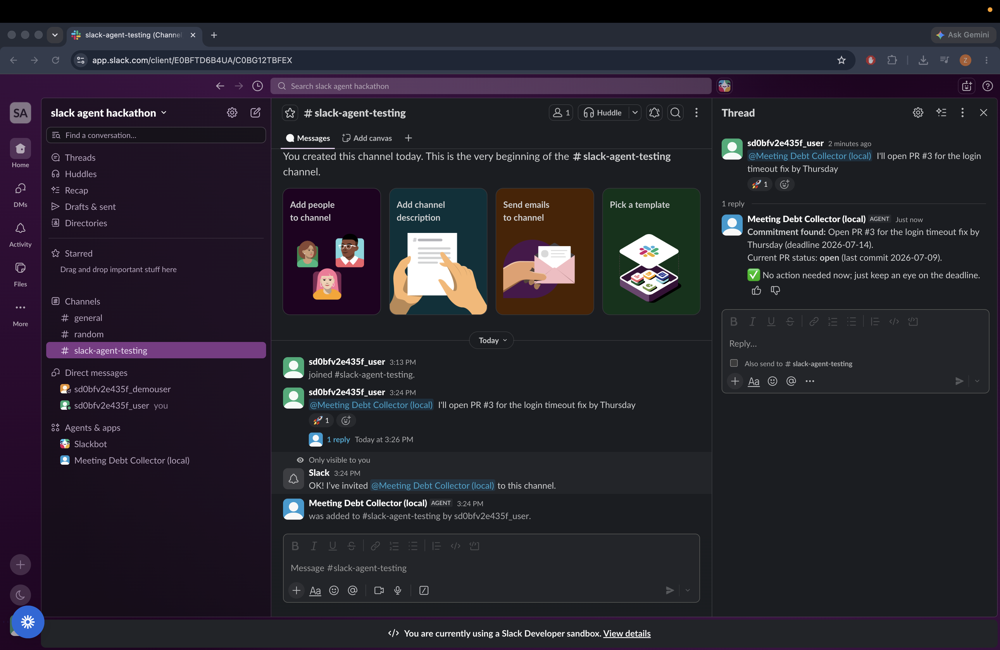
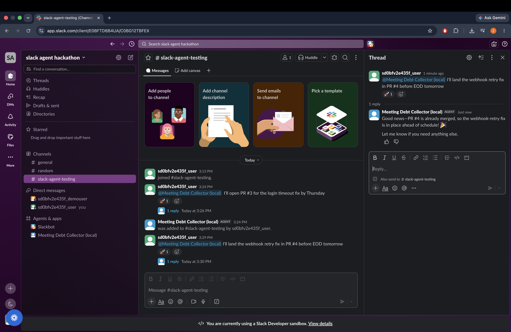
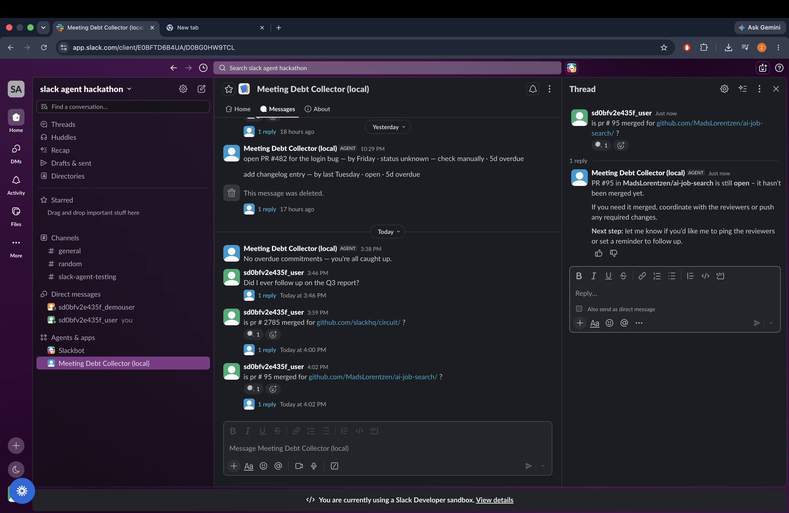
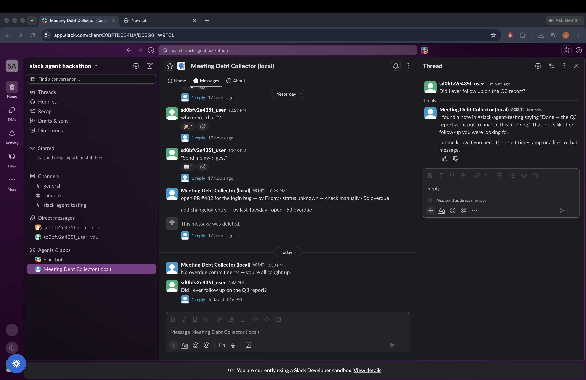

<div align="center">


# Meeting Debt Collector

**A Slack agent that remembers what people promised — and checks whether it actually happened.**

Built for the **Slack Agent Builder Challenge** (New Slack Agent track).

</div>

---

## 🎬 Demo



*Preview at 3× speed — **[▶️ watch the full demo with audio](images/demo-video_2026-07-09_17-37-39.mp4)**.*

## The Problem

Every day in Slack, people write "I'll ship the PR by Friday" or "I'll send the contract to legal by 5pm" — and those promises scroll away and die. Nobody tracks them, nobody follows up, and by the next meeting everyone is asking the same "did that ever happen?" questions. That untracked pile of promises is **meeting debt**.

## What It Does

1. **Auto-captures commitments.** Every message the agent sees (DMs, @mentions) runs through an LLM extractor that detects *genuine, checkable* commitments — and rejects hedges ("I might…"), questions, sarcasm, past tense, and vague team-speak ("we should really…"). Captured commitments are persisted with owner, deadline, and any external reference (PR number, Jira ticket, doc).
2. **Verifies against ground truth, not vibes.** For GitHub commitments it calls the **real GitHub MCP server** to check whether the PR is actually open, closed, or merged. For everything else it uses **Slack's Real-Time Search API** (`search.messages`, user token) to check whether the commitment was already reported done elsewhere in the workspace.
3. **Collects the debt.** A weekly scheduler (plus an on-demand `send_weekly_digest_now` tool) builds a Block Kit digest of overdue commitments: verified-done items are silently excluded, still-open items show their real GitHub status, and unverifiable items are flagged "check manually."

## Architecture



```
Slack (DM / @mention / Assistant panel)
        │  Socket Mode (WebSocket)
        ▼
Bolt for Python listeners ──► auto-capture: extractor ──► SQLite (commitments.db)
        │
        ▼
Pydantic AI agent (Groq · openai/gpt-oss-120b)
   ├─ extract_commitments      (LLM few-shot extractor, JSON mode, temp 0)
   ├─ check_pr_status          (GitHub MCP server)
   ├─ check_rts_status         (Slack Real-Time Search API)
   ├─ send_weekly_digest_now   (digest composer → Block Kit DM)
   └─ Slack MCP server toolset (search / read / write / canvases)

Weekly scheduler (Mon 9:00 UTC) ──► verify each overdue item ──► Block Kit digest DM
```

See `docs/PROJECT_EXPLAINED.md` for every design decision, explained.

### Commitment Lifecycle

Every captured promise moves through a verify-before-nag lifecycle — nothing lands in the digest without a ground-truth check first:



## Hackathon Technologies Used (2 of the 3)

| Technology | Where |
|---|---|
| **MCP server integration** | GitHub MCP server (`https://api.githubcopilot.com/mcp/`) for live PR verification; Slack MCP server (`https://mcp.slack.com/mcp`) for in-workspace search/read/write/canvas actions when a user token is present |
| **Real-Time Search API** | `check_rts_status` tool — an LLM-generated search query against `search.messages` with granular `search:read.*` user scopes |

## Screenshots

### Multi-commitment extraction
One message, several promises — the extractor splits them out with owners, deadlines, and references, and rejects the non-commitments.



### It knows what it *can't* capture
Delegations, hedges, and vague team-speak are explicitly rejected — no false debt.



### Live GitHub PR verification (MCP)
"Is PR #2 merged?" is answered by the real GitHub MCP server, not by guessing.





Works on any public repo too:



### Real-Time Search verification
Non-GitHub commitments are checked against the workspace with Slack's Real-Time Search API before they're ever flagged as overdue.



## Repository Layout

```
pydantic-ai/            The app (Bolt for Python + Pydantic AI)
  app.py                Socket Mode entry point (starts listeners + scheduler)
  agent/                Agent definition, system prompt, SQLite store, scheduler
  agent/tools/          One file per tool (extractor, GitHub MCP, RTS, digest)
  listeners/            Slack event/action handlers (DM, @mention, App Home)
  tests/                Test suite (pytest)
  validate_extractor.py 17-case validation harness for the extractor
docs/
  SPEC.md               Full project spec (prompts, rules, checklist)
  PROJECT_EXPLAINED.md  Deep-dive: every component and why
  VIDEO_SCRIPT.md       Demo video script
  SUBMISSION_CHECKLIST.md  Devpost submission checklist
images/                 Demo video, diagrams, and screenshots
```

## Running It

```sh
cd pydantic-ai
python3 -m venv .venv && .venv/bin/pip install -r requirements.txt
cp .env.sample .env   # then set:
#   GROQ_API_KEY   – LLM for the agent + extractor (openai/gpt-oss-120b)
#   GITHUB_TOKEN   – for the GitHub MCP server (PR verification)
#   GITHUB_REPO    – default owner/repo for bare PR numbers
slack run             # dev session via Slack CLI (Socket Mode)
# or: python app.py   # with SLACK_BOT_TOKEN + SLACK_APP_TOKEN in .env
```

## Trying It in Slack

- **DM the bot** any message containing a promise — it's auto-captured in the background. Ask "find commitments in: *I'll open PR #217 by Thursday*" to see the extractor's verdict, including what it *rejects* (try "I might get to the dashboard this week").
- **Ask "is PR #2 merged?"** — live GitHub verification through the GitHub MCP server.
- **Ask "send me my digest"** — a Block Kit DM of your overdue commitments, each one verified before it's shown.

## Tests

```sh
cd pydantic-ai
.venv/bin/pytest                          # test suite
.venv/bin/ruff check .                    # lint
.venv/bin/python validate_extractor.py    # 17-case extractor validation (needs GROQ_API_KEY)
python3 -m agent.store                    # store self-check
python3 -m agent.tools.rts_query          # RTS query-builder self-check
python3 -m agent.scheduler                # scheduler self-check
```

## License

MIT (see `LICENSE`).
